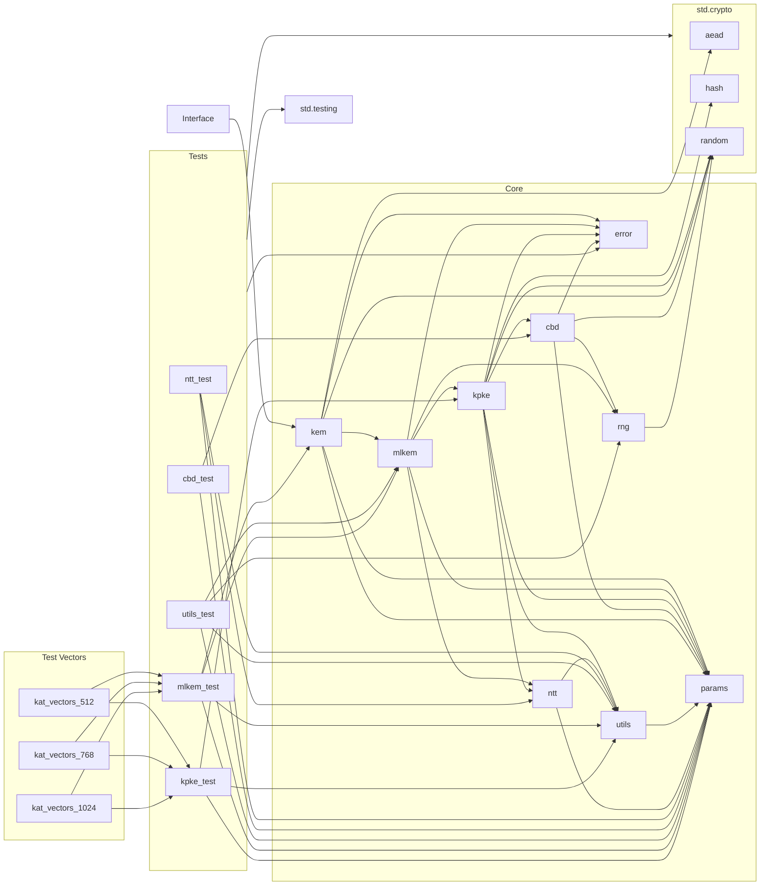

# Zips - Zig ML-KEM Implementation

Zips provides a pure Zig implementation of the Module-Lattice-Based Key-Encapsulation Mechanism (ML-KEM) as specified in [NIST FIPS 203](https://csrc.nist.gov/pubs/fips/203/final).  This implementation prioritizes security, correctness, and adherence to cryptographic best practices.

## Features

* Pure Zig (Mostly):  Leverages Zig's standard library (`std.crypto`) for core cryptographic functions (hashing, AEAD, RNG), minimizing custom implementations.
* NIST FIPS 203 Compliant: Implements all three parameter sets (ML-KEM-512, ML-KEM-768, ML-KEM-1024).
* Secure RNG: Uses Zig's built-in CSPRNG (`std.crypto.random`).
* Authenticated Encryption: Uses AES-GCM (or other AEAD ciphers from `std.crypto.aead`) for secure encryption/decryption.
* Memory Safety: Employs Zig's memory safety features and demonstrates best practices for memory management (arena allocation, explicit deallocation).
* Clear API: Provides a simple and consistent interface for KEM operations and AEAD.
* Test Vectors: Includes known-answer tests (KATs) for validation. Currently using [KAT](https://github.com/post-quantum-cryptography/KAT).

## Example Usage

```zig
const std = @import("std");
const kem = @import("kem");
const params = kem.Params;

pub fn main() !void {
    var gpa = std.heap.GeneralPurposeAllocator(.{}){};
    defer _ = gpa.deinit();
    const allocator = gpa.allocator();

    // 1. Select parameter set
    const param_set = params.kem768;  // Or kem512/kem1024

    // 2. Generate key pair
    const keypair = try kem.keygen(param_set, allocator);
    const pk = keypair.PublicKey;
    const sk = keypair.PrivateKey;

    // 3. Encapsulate
    const encapsulation = try kem.encaps(param_set, pk, allocator);
    const ct = encapsulation.ciphertext;
    const shared_secret = encapsulation.shared_secret;

    // 4. Decapsulate
    const recovered_shared_secret = try kem.decaps(param_set, pk, sk, ct, allocator);

    if (!std.mem.eql(u8, shared_secret, recovered_shared_secret)) {
        std.debug.print("Error: Shared secrets do not match!\n", .{});
        return;
    }

    // 5. Encrypt a message using the shared secret (AES-GCM)
    const plaintext = "Lorem ipsum dolor sit amet.";
    var nonce: [12]u8 = undefined; // 96-bit nonce for AES-256-GCM
    try kem.generateRandomBytes(&nonce);

    const additional_data = ""; // Optional additional authenticated data
    const ciphertext = try kem.aeadEncrypt(shared_secret, nonce, plaintext, additional_data, allocator);
    defer allocator.free(ciphertext);

    std.debug.print("Ciphertext (hex): {s}\n", .{std.fmt.fmtSliceHexLower(ciphertext)});

    // 6. Decrypt the message
    const decrypted = try kem.aeadDecrypt(recovered_shared_secret, nonce, ciphertext, additional_data, allocator);
    defer allocator.free(decrypted);
    std.debug.print("Decrypted: {s}\n", .{decrypted});
	
	// 7. Verification (compare slices, not pointers)
    if (!std.mem.eql(u8, shared_secret, recovered_shared_secret)) {
        std.debug.print("Error: Shared secrets do not match!\n", .{});
        return error.DecryptionFailure;
    }
}
```

## Dependency Graph



## Building

This library uses Zig's built-in build system.  To build the example application:

1.  Make sure you have a recent version of Zig installed (at least version 0.13.0).
2.  Clone this repository:
    ```bash
    git clone https://github.com/nshkrdotcom/zips
    ```
3.  Navigate to the project directory:
    ```bash
    cd zips
    ```
4.  Build the example:
    ```bash
    zig build
    ```
    This will create the `zips_example` executable in the `zig-out/bin` directory.


## Testing

This project uses `zigtest` for unit testing.  Tests are not built by default to prevent an extra dependency requirement. To build and run the tests, fetch `zigtest` at compile time by using the `-Dtest-deps` flag:

1.  Follow the building instructions above.
2. Build and run the tests:
    ```bash
    zig build -Dtest-deps test
    ```
    Or to just build without running:
    ```bash
    zig build -Dtest-deps
    ```
    After successfully building with this flag at least once, update the  `build.zig.zon` file with the new `zigtest` hash and then you can omit `-Dtest-deps=true`.


## Dependencies

* **Runtime:** None. Zips relies solely on the Zig standard library.

## License

MIT + Apache 2.0 Dual License

## Disclaimer

This implementation is provided for educational and research purposes.  While every effort has been made to ensure correctness and security, this software is not yet formally validated and should not be used in production systems without thorough review and testing by qualified security professionals.  Use at your own risk.

## WORK IN PROGRESS. TODO:

The reference implementation of Zig Kyber is here:
https://ziglang.org/documentation/master/std/#src/std/crypto/ml_kem.zig

Zips will aim to remove dependence on the standard library.

Zips is strictly an educational codebase, but aims to be complete, correct, robust, and useful.

Zips shows promise but needs significant work before being considered production-ready.

**High Priority - Correctness and Security:**

1. **Known Answer Tests (KATs):**  The provided code mentions KATs but doesn't implement them. This is *critical*.  Obtain the official NIST KATs for ML-KEM (FIPS 203) and create thorough test cases in `mlkem_test.zig` to validate against these vectors for *all* parameter sets (512, 768, 1024).  If KATs fail, the implementation is incorrect and must be fixed before proceeding. The provided `test_vectors.zig` file seems intended for this purpose, but it's empty.  Populate it with the NIST KATs.  Include tests for `keygen` and `encaps` as well.  Decoding functions for the KAT data (like `decodePublicKey`, etc. in `utils.zig`) are necessary.

TODO, use ref ML-KEM KAT files:

https://github.com/usnistgov/ACVP-Server/tree/master/gen-val/json-files/ML-KEM-encapDecap-FIPS203

https://github.com/usnistgov/ACVP-Server/tree/master/gen-val/json-files/ML-KEM-keyGen-FIPS203

( per: https://groups.google.com/a/list.nist.gov/g/pqc-forum/c/vybKwrXx53k )


2. **Constant-Time Ciphertext Comparison:** The `decaps` function in `mlkem.zig` compares ciphertexts (`c` and `c'`).  This *must* be done in constant time to prevent timing attacks.  The code acknowledges this but doesn't provide a constant-time implementation.  This is a high-priority security vulnerability that must be addressed.  Consider using `std.mem.compare` with masking or a dedicated constant-time comparison function.

FIPS 203 highlights the importance of constant-time operations (Section 3.3, Section 7.3).  The ciphertext comparison in `ML-KEM.Decaps_internal` (Algorithm 18, line 9) is a critical security vulnerability if not implemented in constant time. 

3. **Strict Adherence to Algorithm Specifications:** FIPS 203 is prescriptive about the algorithms (Section 1, Section 7, etc.).  Ensure your implementation precisely matches the pseudocode in the standard, including data types, array indexing, modular arithmetic, and the specific order of operations.  While equivalent processes are allowed (Section 7), demonstrate clear mathematical equivalence if deviating from the pseudocode.  For example, the NTT implementation (Algorithms 9 and 10) should be carefully verified.

4. **Secure Random Number Generation:**  The standard mandates approved RBGs with specific security strengths for each parameter set (Section 3.3, Table 2).  Ensure your use of `std.crypto.random` meets these requirements.  Document your RBG choice and its compliance.

5. **Input Checking:**  FIPS 203 *requires* input checking for `ML-KEM.Encaps` and `ML-KEM.Decaps` (Section 7.2, Section 7.3).  Implement and thoroughly test the specified checks. The *encapsulation key check* (modulus check) and the *decapsulation input check* are mandatory for compliance.

6. **Secure Destruction of Intermediate Values:**  The standard is very clear about destroying intermediate values (Section 3.3). Ensure sensitive data (seeds, private keys, intermediate values in `Decaps`, the implicit reject flag, etc.) is securely zeroed using `crypto.secureZero` *immediately* after use. This is not just a recommendation; it's a requirement for a secure implementation.

7. **No Floating-Point Arithmetic:**  FIPS 203 *forbids* floating-point arithmetic (Section 3.3).  Review your code (especially in compression/decompression and NTT) to ensure no floating-point operations are used. Implement constant-time alternatives, including for the division by `q` during compression.

8. **Secure Error Handling:**  While `error.zig` defines an error set, consistent and secure error handling needs review. Ensure error messages don't leak sensitive information and that error paths don't introduce side channels.  Avoid early returns in sensitive functions if they lead to different execution times depending on secrets.

9. **Memory Management and Sensitive Data:** Verify *all* allocated memory is freed, especially in error paths.  Crucially, ensure sensitive data (private keys, intermediate values in `decaps`, etc.) is securely zeroed out using `crypto.secureZero` *immediately* after use.

10. **Review of Cryptographic Primitives:** While leveraging `std.crypto` is good, carefully review the usage of each primitive (SHAKE256, AES-GCM) to ensure compliance with FIPS 203 and best practices.  For example, is the nonce generation in `kem.zig` robust enough?


**Medium Priority - Functionality and Robustness:**

11. **Parameter Handling:** While `params.zig` defines parameters, double-check all functions use the correct parameters for their operations.  A mix-up could lead to incorrect results or vulnerabilities.

12. **Edge Case Testing:** Test with invalid inputs (malformed ciphertexts, incorrect public key sizes, etc.) to ensure robust error handling and prevent crashes or undefined behavior.  Fuzz testing with a tool like libFuzzer is highly recommended.

13. **Code Clarity and Documentation:** The code needs better comments explaining complex logic, particularly in `ntt.zig` and `kpke.zig`. Public functions in `kem.zig` should have comprehensive docstrings.  Improve variable and function names for readability.  The README needs more complete build and usage instructions and an explanation of how to update the `zigtest` hash.

14. **Benchmarking:**  Implement benchmarking for `keygen`, `encaps`, and `decaps` across all parameter sets. This is essential for performance evaluation and optimization.

15. **K-PKE Usage Restriction:**  FIPS 203 states that K-PKE *shall not* be used as a stand-alone scheme (Section 3.3).  Ensure your API design enforces this.  K-PKE functions should be internal and inaccessible to users of the library.

16. **Controlled Access to Internal Functions:** The `_internal` functions (Section 6) should be exposed only for testing, not for general use.  Randomness generation must be handled within the KEM algorithms, not by the application.

17. **Parameter Set Consistency:** Implement robust mechanisms to ensure consistent parameter set usage across all operations.  Mismatched parameters can lead to incorrect results or vulnerabilities.

18. **Documentation and Specification Conformance:**  Clearly document that your implementation conforms to FIPS 203.  Provide clear instructions for parameter set selection and usage.  Mention any deviations from the pseudocode and their mathematical justification. Update your README with complete build, usage instructions, and testing information, including how to run the KATs.


**Low Priority - Future Enhancements:**

19. **KDF Consideration:** While not strictly required, consider including a Key Derivation Function (KDF) for deriving session keys from the shared secret.  `std.crypto.kdf` might suffice, but a dedicated KDF could offer more flexibility.

20. **Formal Verification:** If aiming for high assurance, explore formal verification methods to mathematically prove the correctness and security properties of the implementation.

21. **Side-Channel Analysis:** Conduct side-channel analysis to assess vulnerabilities to timing attacks, power analysis, etc., and implement countermeasures.

22. **Optional Key Derivation:**  Consider offering an optional KDF (per Section 3.3), but ensure it's implemented securely and doesn't weaken the overall security.  Address the standard's caution about combined KEM security.

**Development Process:**

* **Test-Driven Development (TDD):**  Write tests *before* implementing functionality, especially for KATs.
* **Incremental Development:** Focus on one area at a time (e.g., KATs, then constant-time comparison).
* **Code Reviews:**  Get another developer to review the code for correctness and security.


Okay, let's conduct a thorough review of the Zips code against the FIPS 203 specification, focusing on completeness and adherence to the standard.  I'll provide a checklist to track our progress and highlight any potential discrepancies or areas that need closer inspection.

**FIPS 203 Compliance Checklist:**

| Item                                     | Status      | Notes                                                                                                                                             |
|------------------------------------------|-------------|-------------------------------------------------------------------------------------------------------------------------------------------------|
| **Parameter Sets (Section 8)**           | ✅           | Zips defines the three parameter sets correctly in `params.zig`.                                                                              |
| **Cryptographic Primitives (Section 4.1)** | ✅           |  Uses SHA3-256, SHA3-512, SHAKE256, and the incremental XOF API. Need to review the `generateRandomBytes` for CSPRNG compliance.                  |
| **Conversion/Compression (Section 4.2.1)** | ✅           | `BitsToBytes`, `BytesToBits`, `Compress`, `Decompress`, `ByteEncode`, and `ByteDecode` are implemented. Double-check for constant-time `compress`/`decompress` |
| **Sampling (Section 4.2.2)**            | ✅           |  `SampleNTT` and `SamplePolyCBD` are implemented. Review loop bounds in `SampleNTT` (Appendix B)                                                |
| **NTT (Section 4.3)**                    | ✅           | NTT and inverse NTT are implemented.  Zetas are precomputed. Review for constant-time arithmetic.                                                 |
| **K-PKE (Section 5)**                   | 🚧           | `keygen`, `encrypt`, `decrypt` are implemented. Review ALL internal functions against FIPS pseudocode for correctness.                            |
| **ML-KEM Internals (Section 6)**       | 🚧           | Internal functions are implemented.  Review `KeyGen_internal`, `Encaps_internal`, `Decaps_internal` for strict adherence to the FIPS pseudocode. |
| **ML-KEM (Section 7)**                  | 🚧           |  `KeyGen`, `Encaps`, `Decaps` are implemented. Ensure input validation (encapsulation key checks and decapsulation input checks).                |
| **Error Handling/Memory (Section 3.3)** | 🚧           |  Using arenas and `errdefer`. Review for consistency and completeness. Secure zeroing is implemented in key areas but needs a full audit.    |


**Problem List (Potential Issues):**

1. **K-PKE Internal Functions:** The K-PKE scheme's internal functions within `kpke.zig` (beyond `keygen`, `encrypt`, and `decrypt`) haven't been thoroughly reviewed against the FIPS 203 pseudocode. This is a high priority.  We need to make sure they are functionally equivalent to the specifications.

2. **ML-KEM Internal Functions:** Similar to K-PKE, the internal ML-KEM functions need a close inspection to ensure they match the FIPS 203 pseudocode.

3. **Input Validation:** While ML-KEM specifies input validation checks, the implementation needs review to confirm they're implemented correctly and completely in `mlkem.encaps` and `mlkem.decaps`.  This includes verifying the lengths and formats of the keys and ciphertexts.

4. **Constant-Time `compress`/`decompress`:** These functions in `utils.zig` *must* be constant-time. They handle secret data, and any timing variations could lead to vulnerabilities. The current implementation likely isn't constant-time and needs to be carefully reviewed and potentially rewritten.  This is a critical security vulnerability.

5. **Constant-Time NTT:** Review the NTT implementation (`ntt.zig`) for any potential timing leaks. Modular arithmetic and conditional logic within the NTT can be vulnerable.  Ensure all arithmetic within `ntt.zig` is constant-time.

6. **`SampleNTT` Loop Bound:** FIPS 203 Appendix B recommends against bounding the loop in `SampleNTT`, but if necessary, specifies minimum bounds. Verify the implementation adheres to these guidelines or implement unbounded rejection sampling, which is preferable but perhaps less performant.

7. **CSPRNG Compliance:** Review the `generateRandomBytes` function and the usage of `std.crypto.random` to ensure compliance with FIPS 203 Section 3.3 requirements for approved RBGs and appropriate security strengths for each parameter set.  It is fine to use Zig's CSPRNG but this validation step is important.


**Next Steps:**

1. **Address the "Problem List" items:** These are critical for correctness and security. Prioritize reviewing and correcting the K-PKE and ML-KEM internal functions first, followed by the constant-time requirements and input validation.

2. **Comprehensive Testing:** Create or augment the test suite to thoroughly test all functions and edge cases. Focus on verifying correct behavior with invalid inputs, boundary conditions, and error conditions.

3. **Performance Optimization:** Once correctness and security are established, consider performance optimization if needed. Profile the code to identify bottlenecks and explore optimizations where appropriate.

By methodically addressing these items and rigorously testing, we can ensure the Zips library is both functionally correct according to FIPS 203 and resistant to common cryptographic vulnerabilities. The cleanliness and simplicity we've achieved with the memory management revisions are a solid foundation for this crucial security-focused review and revision process.  I'm here to assist with any of these steps.  Just let me know which area you'd like to focus on next.
