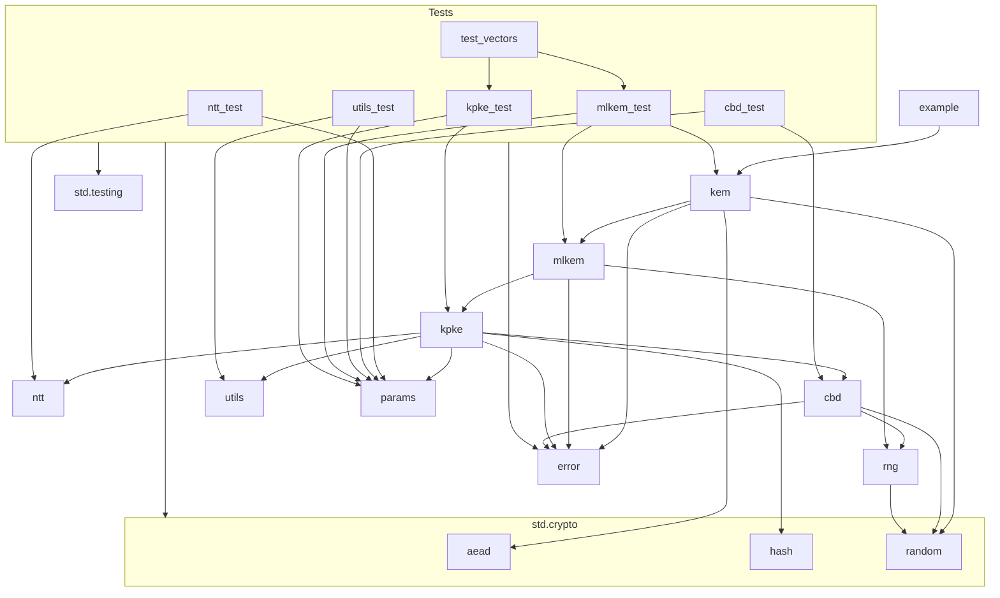

# Zips - Zig ML-KEM Implementation

Zips provides a pure Zig implementation of the Module-Lattice-Based Key-Encapsulation Mechanism (ML-KEM) as specified in [NIST FIPS 203](https://csrc.nist.gov/pubs/fips/203/final).  This implementation prioritizes security, correctness, and adherence to cryptographic best practices.

## Features

* Pure Zig (Mostly):  Leverages Zig's standard library (`std.crypto`) for core cryptographic functions (hashing, AEAD, RNG), minimizing custom implementations.
* NIST FIPS 203 Compliant: Implements all three parameter sets (ML-KEM-512, ML-KEM-768, ML-KEM-1024).
* Secure RNG: Uses Zig's built-in CSPRNG (`std.crypto.random`).
* Authenticated Encryption: Uses AES-GCM (or other AEAD ciphers from `std.crypto.aead`) for secure encryption/decryption.
* Memory Safety: Employs Zig's memory safety features and demonstrates best practices for memory management (arena allocation, explicit deallocation).
* Clear API: Provides a simple and consistent interface for KEM operations and AEAD.
* Test Vectors: Includes known-answer tests (KATs) for validation.

## Example Usage

```zig
const std = @import("std");
const kem = @import("kem");
const params = kem.Params;

pub fn main() !void {
    var gpa = std.heap.GeneralPurposeAllocator(.{}){};
    defer _ = gpa.deinit();
    const allocator = gpa.allocator();

    // 1. Select parameter set
    const param_set = params.kem768;  // Or kem512/kem1024

    // 2. Generate key pair
    const keypair = try kem.keygen(param_set, allocator);
    defer {
        kem.destroyPrivateKey(&keypair.privateKey);
        kem.destroyPublicKey(&keypair.publicKey);
    }
    const pk = keypair.publicKey;
    const sk = keypair.privateKey;

    // 3. Encapsulate
     const encapsulation = try kem.encaps(param_set, pk, allocator);
    defer kem.destroyCiphertext(&encapsulation.ciphertext);
    const ct = encapsulation.ciphertext;
    const shared_secret = encapsulation.shared_secret;

    // 4. Decapsulate
    const recovered_shared_secret = try kem.decaps(param_set, sk, ct, allocator);

    if (!std.mem.eql(u8, shared_secret, recovered_shared_secret)) {
        std.debug.print("Error: Shared secrets do not match!\n", .{});
        return;
    }

    // 5. Encrypt a message using the shared secret (AES-GCM)
    const plaintext = "Lorem ipsum dolor sit amet.";
    var nonce: [12]u8 = undefined; // 96-bit nonce for AES-256-GCM
    try kem.generateRandomBytes(&nonce);

    const additional_data = ""; // Optional additional authenticated data
    const ciphertext = try kem.aeadEncrypt(shared_secret, nonce, plaintext, additional_data, allocator);
    defer allocator.free(ciphertext);

    std.debug.print("Ciphertext (hex): {s}\n", .{std.fmt.fmtSliceHexLower(ciphertext)});

    // 6. Decrypt the message
    const decrypted = try kem.aeadDecrypt(recovered_shared_secret, nonce, ciphertext, additional_data, allocator);
    defer allocator.free(decrypted);
    std.debug.print("Decrypted: {s}\n", .{decrypted});
	
	// 7. Verification (compare slices, not pointers)
    if (!std.mem.eql(u8, shared_secret, recovered_shared_secret)) {
        std.debug.print("Error: Shared secrets do not match!\n", .{});
        return error.DecryptionFailure;
    }
}
```

## Dependency Graph



## Building

This library uses Zig's built-in build system.  To build the example application:

1.  Make sure you have a recent version of Zig installed (at least version 0.13.0).
2.  Clone this repository:
    ```bash
    git clone https://github.com/nshkrdotcom/zips
    ```
3.  Navigate to the project directory:
    ```bash
    cd zips
    ```
4.  Build the example:
    ```bash
    zig build
    ```
    This will create the `zips_example` executable in the `zig-out/bin` directory.


## Testing

This project uses `zigtest` for unit testing.  Tests are not built by default to prevent an extra dependency requirement. To build and run the tests, fetch `zigtest` at compile time by using the `-Dtest-deps` flag:

1.  Follow the building instructions above.
2. Build and run the tests:
    ```bash
    zig build -Dtest-deps test
    ```
    Or to just build without running:
    ```bash
    zig build -Dtest-deps
    ```
    After successfully building with this flag at least once, update the  `build.zig.zon` file with the new `zigtest` hash and then you can omit `-Dtest-deps=true`.


## Dependencies

* **Runtime:** None. Zips relies solely on the Zig standard library.

## License

MIT + Apache 2.0 Dual License

## Disclaimer

This implementation is provided for educational and research purposes.  While every effort has been made to ensure correctness and security, this software is not yet formally validated and should not be used in production systems without thorough review and testing by qualified security professionals.  Use at your own risk.

## WORK IN PROGRESS. TODO:

Zips shows promise but needs significant work before being considered production-ready.

**High Priority - Correctness and Security:**

1. **Known Answer Tests (KATs):**  The provided code mentions KATs but doesn't implement them. This is *critical*.  Obtain the official NIST KATs for ML-KEM (FIPS 203) and create thorough test cases in `mlkem_test.zig` to validate against these vectors for *all* parameter sets (512, 768, 1024).  If KATs fail, the implementation is incorrect and must be fixed before proceeding. The provided `test_vectors.zig` file seems intended for this purpose, but it's empty.  Populate it with the NIST KATs.  Include tests for `keygen` and `encaps` as well.  Decoding functions for the KAT data (like `decodePublicKey`, etc. in `utils.zig`) are necessary.

2. **Constant-Time Ciphertext Comparison:** The `decaps` function in `mlkem.zig` compares ciphertexts (`c` and `c'`).  This *must* be done in constant time to prevent timing attacks.  The code acknowledges this but doesn't provide a constant-time implementation.  This is a high-priority security vulnerability that must be addressed.  Consider using `std.mem.compare` with masking or a dedicated constant-time comparison function.

3. **Secure Error Handling:**  While `error.zig` defines an error set, consistent and secure error handling needs review. Ensure error messages don't leak sensitive information and that error paths don't introduce side channels.  Avoid early returns in sensitive functions if they lead to different execution times depending on secrets.

4. **Memory Management and Sensitive Data:** Verify *all* allocated memory is freed, especially in error paths.  Crucially, ensure sensitive data (private keys, intermediate values in `decaps`, etc.) is securely zeroed out using `std.crypto.secureZero` *immediately* after use.

5. **Review of Cryptographic Primitives:** While leveraging `std.crypto` is good, carefully review the usage of each primitive (SHAKE256, AES-GCM) to ensure compliance with FIPS 203 and best practices.  For example, is the nonce generation in `kem.zig` robust enough?

**Medium Priority - Functionality and Robustness:**

6. **Parameter Handling:** While `params.zig` defines parameters, double-check all functions use the correct parameters for their operations.  A mix-up could lead to incorrect results or vulnerabilities.

7. **Edge Case Testing:** Test with invalid inputs (malformed ciphertexts, incorrect public key sizes, etc.) to ensure robust error handling and prevent crashes or undefined behavior.  Fuzz testing with a tool like libFuzzer is highly recommended.

8. **Code Clarity and Documentation:** The code needs better comments explaining complex logic, particularly in `ntt.zig` and `kpke.zig`. Public functions in `kem.zig` should have comprehensive docstrings.  Improve variable and function names for readability.  The README needs more complete build and usage instructions and an explanation of how to update the `zigtest` hash.

9. **Benchmarking:**  Implement benchmarking for `keygen`, `encaps`, and `decaps` across all parameter sets. This is essential for performance evaluation and optimization.

**Low Priority - Future Enhancements:**

10. **KDF Consideration:** While not strictly required, consider including a Key Derivation Function (KDF) for deriving session keys from the shared secret.  `std.crypto.kdf` might suffice, but a dedicated KDF could offer more flexibility.

11. **Formal Verification:** If aiming for high assurance, explore formal verification methods to mathematically prove the correctness and security properties of the implementation.

12. **Side-Channel Analysis:** Conduct side-channel analysis to assess vulnerabilities to timing attacks, power analysis, etc., and implement countermeasures.

**Development Process:**

* **Test-Driven Development (TDD):**  Write tests *before* implementing functionality, especially for KATs.
* **Incremental Development:** Focus on one area at a time (e.g., KATs, then constant-time comparison).
* **Code Reviews:**  Get another developer to review the code for correctness and security.