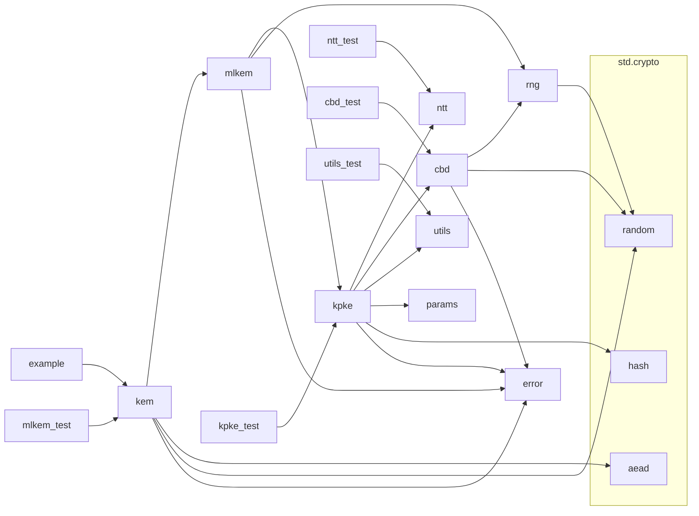

# Zips - Zig ML-KEM Implementation

Zips provides a pure Zig implementation of the Module-Lattice-Based Key-Encapsulation Mechanism (ML-KEM) as specified in FIPS 203.  This implementation prioritizes security, correctness, and adherence to cryptographic best practices.

## Features

* Pure Zig (Mostly):  Leverages Zig's standard library (`std.crypto`) for core cryptographic functions (hashing, AEAD, RNG), minimizing custom implementations.
* FIPS 203 Compliant: Implements all three parameter sets (ML-KEM-512, ML-KEM-768, ML-KEM-1024).
* Secure RNG: Uses Zig's built-in CSPRNG (`std.crypto.random`).
* Authenticated Encryption: Uses AES-GCM (or other AEAD ciphers from `std.crypto.aead`) for secure encryption/decryption.
* Memory Safety: Employs Zig's memory safety features and demonstrates best practices for memory management (arena allocation, explicit deallocation).
* Clear API: Provides a simple and consistent interface for KEM operations and AEAD.
* Test Vectors: Includes known-answer tests (KATs) for validation.

## Example Usage

```zig
const std = @import("std");
const kem = @import("kem");
const params = kem.Params;

pub fn main() !void {
    var gpa = std.heap.GeneralPurposeAllocator(.{}){};
    defer _ = gpa.deinit();
    const allocator = gpa.allocator();

    // 1. Select parameter set (ML-KEM-768 is recommended)
    const param_set = params.kem768;

    // 2. Generate key pair
    const keypair = try kem.keygen(param_set, allocator);
    defer {
        kem.destroyPrivateKey(&keypair.privateKey); // Pass pointer to destroy function
        kem.destroyPublicKey(&keypair.publicKey);  // Pass pointer to destroy function
    }
    const pk = keypair.publicKey;
    const sk = keypair.privateKey;

    // 3. Encapsulate
    const encapsulation = try kem.encaps(pk, param_set, allocator);
    defer kem.destroyCiphertext(&encapsulation.ciphertext);
    const ct = encapsulation.ciphertext;
    const shared_secret = encapsulation.shared_secret;

    // 4. Decapsulate
    const recovered_shared_secret = try kem.decaps(sk, ct, param_set);

    // 5. Encrypt a message (using AES-GCM from std.crypto.aead)
    const plaintext = "Lorem ipsum dolor sit amet.";

    // Generate a 96-bit nonce (12 bytes) for AES-GCM
    var nonce: [12]u8 = undefined;
    try kem.generateRandomBytes(&nonce); // Use your kem interface for random bytes

    const additional_data = ""; // Or any additional authenticated data
    const ciphertext = try kem.encrypt(shared_secret, nonce, plaintext, additional_data, allocator);
    defer allocator.free(ciphertext);

    // 6. Decrypt the message
    const decrypted = try kem.decrypt(recovered_shared_secret, nonce, ciphertext, additional_data, allocator); // Add allocator
    defer allocator.free(decrypted); // Free decrypted plaintext
    std.debug.print("Decrypted: {s}\n", .{decrypted});

    // 7. Verification
    if (!std.mem.eql(u8, &shared_secret, &recovered_shared_secret)) { // Compare by reference
        std.debug.print("Error: Shared secrets do not match!\n", .{});
        return error.DecryptionFailure;
    }
}
```

## Dependency Graph



## Building

`zig build`

## Testing

`zig build test`

## Dependencies

None. This implementation relies solely on the Zig standard library.

## License

MIT + Apache 2.0 Dual License

## Disclaimer

This implementation is provided for educational and research purposes.  While every effort has been made to ensure correctness and security, this software is not yet formally validated and should not be used in production systems without thorough review and testing by qualified security professionals.  Use at your own risk.
